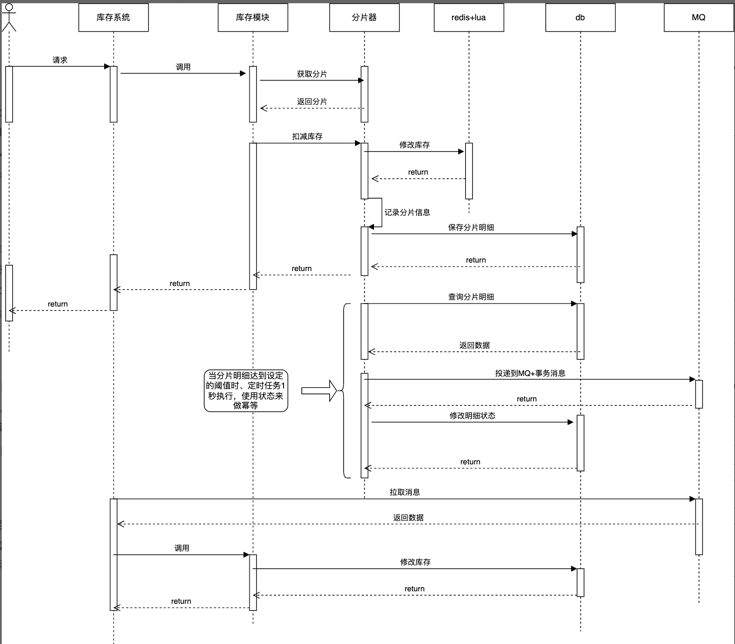
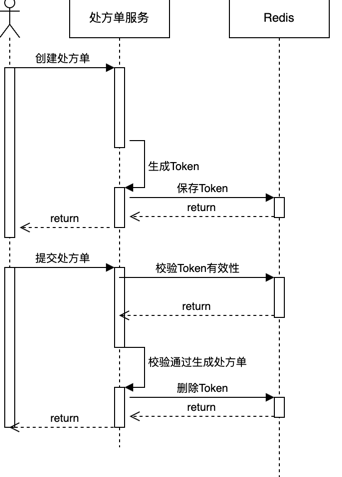

# Prescription Management System

一个基于 Spring Boot 的处方管理系统，支持药品管理、药房管理、处方创建与履约、库存扣减等功能。

---

## 📌 功能概述

1. **药品管理**
    - 添加药品信息（名称、制造商、批次号、过期日期、库存等）
2. **药房管理**
    - 分页查询药房及其分配的药品
3. **处方管理**
    - 创建处方单（包含多个药品项）
    - 履约处方单（扣减库存）
4. **审计日志**
    - 记录处方操作日志（成功/失败）

---

## 🧱 技术栈

- **后端框架**：Spring Boot 2.x
- **数据库**：MySQL 8.x
- **ORM 框架**：MyBatis Plus
- **缓存**：Redis（用于本地锁扩展）
- **并发控制**：线程池 + Redis 分布式锁（预留接口）
- **测试框架**：JUnit 5, Mockito
- **构建工具**：Maven

---

## 🗂️ 项目结构

```
src
├── main
│   ├── java
│   │   └── com.myproject.prescription
│   │       ├── config        # 配置类（线程池、锁、MyBatis 插件）
│   │       ├── controller    # REST API 接口
│   │       ├── dao           # 数据访问层（Entity 和 Mapper）
│   │       ├── enums         # 枚举定义（状态码、异常类型）
│   │       ├── exception     # 异常处理模块
│   │       ├── lock          # 锁机制（本地锁和分布式锁接口）
│   │       ├── pojo          # DTO、POJO、分页相关类
│   │       ├── service       # 业务逻辑接口及实现
│   │       └── utils         # 工具类（断言、分页工具）
│   └── resources
│       ├── application.yml   # 配置文件
│       └── db/ddl.sql        # 数据库建表语句
└── test
    └── java
        └── com.myproject.prescription
            └── service       # 单元测试类
```


---

## 🛠️ 核心功能详解
### 注意
为了避免接口的定义的歧义以及降低前后端对接的成本，API并没有严格遵守REST风格，而是统一使用POST方法

### 1. 药品管理

#### ✅ 添加药品 (`DrugController.addDrug`)
- 请求路径: `POST /drugs/add`
- 请求体:
  ```json
  {
    "name": "维生素A",
    "manufacturer": "制药厂",
    "batchNumber": "BATCH123",
    "expiryDate": "2024-12-31T00:00:00",
    "stock": 100
  }
  ```

- 响应:
  ```json
  { "code": "1", "message": "success" }
  ```

### 2. 药房管理

#### 🔍 查询药房列表及其药品 ([PharmacyController.listPharmacies](file:///Users/buyaokanwodediannao/Downloads/prescription-manage-server/src/main/java/com/myproject/prescription/controller/PharmacyController.java#L26-L29))
- 请求路径: `POST /pharmacies/page`
- 请求体:
  ```json
  {
    "page": 1,
    "size": 10,
    "req": {
      "name": "药房大楼"
    }
  }
  ```

- 响应:
  ```json
  {
    "data": [
      {
        "pharmacyId": 1,
        "pharmacyName": "药房大楼",
        "pharmacyAddress": "XX街道",
        "drugs": [
          { "id": 1, "name": "维生素A", "stock": 50 }
        ]
      }
    ],
    "total": 1
  }
  ```


---

### 3. 处方管理

#### ✅ 创建处方 (`PrescriptionController.create`)
- 请求路径: `POST /prescriptions/create`
- 请求体:
  ```json
  {
    "patientId": "P123",
    "pharmacyId": 1,
    "drugs": [
      { "drugId": 1, "drugName": "维生素A", "dosage": "每日两次", "quantity": 10 }
    ]
  }
  ```

- 响应:
  ```json
  { "code": "1", "message": "success" }
  ```


#### ✅ 履约处方 (`PrescriptionController.fulfill`)
- 请求路径: `POST /prescriptions/fulfill?prescriptionId=1`
- 响应:
  ```json
  { "code": "1", "message": "success" }
  ```


#### 🔍 状态流转
- `CREATED` → `SUCCESS` 或 `FAIL`（幂等处理）
- 失败时记录日志并释放预扣库存

---

### 4. 审计日志

#### 🔍 查询处方操作日志 (`AuditLogController.queryAuditLogs`)
- 请求路径: `POST /audit-logs/page`
- 请求体:
  ```json
  {
    "page": 1,
    "size": 10,
    "req": {
      "patientId": "P123",
      "status": 1
    }
  }
  ```

- 响应:
  ```json
  {
    "data": [
      {
        "prescriptionId": 1,
        "status": 1,
        "requestedDrugs": [ ... ],
        "dispensedDrugs": [ ... ]
      }
    ]
  }
  ```


---

## ⚙️ 配置说明

### [application.yml](file:///Users/buyaokanwodediannao/Downloads/prescription-manage-server/src/main/resources/application.yml)
```yaml
server:
  port: 8080

spring:
  datasource:
    url: jdbc:mysql://localhost:3306/prescription
    username: root
    password:
    driver-class-name: com.mysql.cj.jdbc.Driver

  redis:
    host: localhost
    port: 6379
```


---

## 🧪 测试说明

### 单元测试目录
- [DrugServiceTest.java](file:///Users/buyaokanwodediannao/Downloads/prescription-manage-server/src/test/java/com/myproject/prescription/service/DrugServiceTest.java)
- [PharmacyServiceTest.java](file:///Users/buyaokanwodediannao/Downloads/prescription-manage-server/src/test/java/com/myproject/prescription/service/PharmacyServiceTest.java)
- [PrescriptionServiceTest.java](file:///Users/buyaokanwodediannao/Downloads/prescription-manage-server/src/test/java/com/myproject/prescription/service/PrescriptionServiceTest.java)

### 测试覆盖点
- 并发安全库存扣减
- 库存不足、药品过期、药房未分配等边界情况
- 日志记录准确性
- 幂等履约处理

---

## 🧩 依赖组件

### 数据库表结构 ([ddl.sql](file:///Users/buyaokanwodediannao/Downloads/prescription-manage-server/src/main/resources/db/ddl.sql))
- `drug`: 药品主表
- `pharmacy`: 药房主表
- `pharmacy_drug`: 药房与药品关系表
- `prescription`: 处方主表
- `prescription_item`: 处方明细表
- `audit_log`: 审计日志表

---

## 📦 启动方式

```bash
mvn spring-boot:run
```


或打包后运行：
```bash
mvn package
java -jar target/prescription-manage-server.jar
```


---

## 📝 注意事项

- 使用本地锁进行库存预扣，可扩展为 Redis 分布式锁。
- 使用线程池异步记录日志。
- 支持并发请求创建处方，防止超卖。


## 📝 后期优化
- 结合Redis+Lua+MQ实现异步扣减库存，支持高并发场景。
- 提交处方单创建时新增防重校验。

# 库存扣减方案

## 一、数据库乐观锁
### 优点
- 实现简单

### 缺点
- 数据库读写压力大
- 如果乐观锁更新失败是重试还是直接返回失败，重试会增加数据的压力
- 同步阻塞操作数据库，性能瓶颈在数据库上

## 二、分布式锁+缓存读请求
### 优点
- 缓存减小数据库读压力
- 分布式锁减小数据库的写压力

### 缺点
- 请求阻塞在分布式锁的获取上，高并发场景下性能可能不足

## 三、异步扣减库存

### 优点
- 使用redis+lua的特性，不需要在应用层面做同步控制
- 通过redis+MQ异步解耦，降低数据库压力

### 缺点
- redis单节点会成为性能瓶颈，且存在单点问题，系统可用性降低

## 四、分片+异步


### 分片器的作用
1. 获取扣减库存的分片
2. 管理分片信息，持久化分片明细
3. 切换分片子域
4. 补充预占库存

### 分片策略
1. **轮询**：对分片集合封装成一个数组，轮询数组，直到库存充足为止。为了避免每次从头开始轮询对前面的分片压力大，每次请求将分片数组随机打散，然后轮询。
2. **随机**：随机算法分为普通随机和加权随机，为分片集合分配一个数组，设置不同的权重，然后随机返回一个分片。
3. **哈希**：对requestID取模分片数组size，获取分片。
4. **最小请求数**：分片器会记录每个分片的请求信息，维护了一个按照请求数排序的有序集合，从中选出请求数最少的分片。
5. **最大库存量**：分片器会记录每个分片及其子域的库存数量，优先返回库存最多的分片。

### 管理、保存分片信息
1. 定时任务每隔一秒查询分片集的所有分片库存信息，保存在客户端内存中。
2. Redis库存扣减和保存分片明细在同一个本地事务中，先扣库存后保存明细失败会从代码层面回滚Redis库存，但是极端情况下比如服务器上下线或者服务宕机会导致回滚失败，导致少卖。
3. 数据库分库分表，分散写流量，并且由于是新增，没有锁竞争，数据库能够支撑。

### 切换分片子域
每个分片会有至少两个子域，同一时间只有一个子域激活提供服务。后台定时任务统计分片信息时，当激活子域库存小于设定的阈值，比如10%，会自动触发切换子域，分片器维护了分片和子域的key映射，切换子域就是更新key映射。

### 补充预占库存
库存管理分为预占库存和实际库存，因为是异步扣减库存，在Redis扣减的是预占库存，后续消费消息后对库存进行实际的更新。
预占库存有一个预占库存池，分片器初始化会去池中申请库存，后续分片器触发子域切换也会去池中申请库存，当池中库存消耗完分片器会申请库存失败。

### 解决数据倾斜
1. 每个分片上保存多个子域，同时只有一个激活的子域对外服务，当激活子域的库存数量小于阈值则切换备用子域，然后切换后的子域会自动补充库存。避免了因为分片上库存被快速消耗完导致扣减库存不足发起重试，重试会请求其他节点，极端情况下会遍历所有节点，会大大降低接口性能。
2. 当分片库存不足自动补充库存时，如果预占库存池库存消耗完，分片补充库存失败后会被剔除出分片集，避免了请求打到没有库存的分片造成库存扣减失败。
3. 减少单分片上的库存，分片库存不应该设置太大，避免因为流量倾斜时过多流量打到同一个分片上，增加分片节点负载。
4. 选择合适的分片策略，比如hash算法下，如果requestID是递增的，使用requestID作为hash分片键能够使请求均匀打到分片集中的各个节点上；比如根据分片器统计的分片请求数据，可以知道热点分片，减少对热点分片的请求。

## 压测结果

### 压测工具
- Jmeter
- Junit5 + Junitperf

### 测试环境
- 本地机器配置：MAC-8核16G
- 参照项：数据库库存不分片8线程tps1200-1400
- 以下测试数据基于数据库库存10个分片

| 线程数/类型 | 1   | 8    | 16   | 64   | 100  |
|-------------|-----|------|------|------|------|
| 数据库乐观锁&自旋 | 1,156 | 4,200 | 5,005 | 4,715 | 4,332 |
| Redis分布式锁     | 583  | 4,796 | 4,802 | 4,207 | 4,332 |
| Redis+lua异步      | 3,373 | 15,535 | 15,729 | 15,127 | 15,140 |

### 结论
1. 数据库乐观锁和Redis分布式锁结果差不多，因为底层瓶颈都在更新数据库库存，但是依靠数据库乐观锁会使数据库CPU使用率飙高，最高到200+%，所以如果并发量不是很大可以使用Redis分布式锁方式来扣减库存。
2. QPS最高的是Redis+lua脚本异步扣减库存，不管是在单线程还是多线程下性能是其他的三倍，并且数据库的CPU使用率只有70-80%，因此在高并发场景优先选择。
3. 线程数配置，在并发线程数跟服务器CPU核数相同时QPS已经接近峰值了，即使扩大到两倍涨幅也很小，超过两倍后QPS开始下降，所以初始设置的线程数可以优先考虑设置成服务器可用CPU核数，后续可以根据压测结果和线上的真实情况调整对应的核心线程数、最大线程数以及队列大小。

# 订单防重设计方案

## 问题背景
因为网络原因或者恶意请求，用户可能会重复提交处方单，导致处方单重复生成。
## 解决方案概述
采用 **Token机制** 实现防重：
1. 用户填写所有处方单信息后保存，同时服务端生成唯一 Token；
2. 提交时携带 Token 进行校验，通过后再生成处方单。

---

## 核心流程


## 方案对比

### 方案一：先删 Token 再生成处方单
#### 流程
```
校验Token通过 → 删除Token → 生成处方单
```


#### 优点
- 利用 Redis 单线程特性 + Lua 脚本保证原子性；
- 性能高、吞吐量大、实现简单。

#### 缺点
- 如果生成处方单失败（如服务宕机），会导致Token失效；

---

### 方案二：先生成处方单再删除 Token
#### 流程
```
加分布式锁 → 校验Token → 校验处方单是否已存在 → 生成处方单 → 删除Token
```


#### 优点
- 避免Token失效风险；
- 更安全地处理并发请求。

#### 缺点
- 并发问题：多个请求可能同时通过 Token 校验；
- 删除 Token 失败影响后续流程；
- 性能瓶颈主要集中在 MySQL 查询和插入操作；
---

## 关键设计点

### 1. Token 校验顺序
- 必须先校验 Token 是否存在；
- 再检查订单是否已存在；
- 原因：Token 删除失败是小概率事件，大部分重复请求不会进入订单校验阶段。

### 2. 不使用数据库唯一键的原因
- 唯一键插入冲突会阻塞其他请求；
- 普通索引 + 插入意向锁性能更好。

---

## 性能分析

### 瓶颈分析
- Redis 操作性能远高于 MySQL；
- 所有方案的性能瓶颈集中在 MySQL 插入操作。

### 推荐方案
- **推荐使用方案一**（先删 Token 再生成处方单）：
    - 性能高、实现简单；
    - 利用 Redis 单线程 + Lua 原子性保障并发安全；
    - 需要业务上接受极小概率Token失效风险。

- **不建议使用方案二**：
    - 分布式锁带来额外开销（Redis IO）；
    - 数据库本地事务控制复杂，资源占用高。

---

## 总结建议

| 方案              | 特性                           | 推荐程度 |
|-----------------|------------------------------|----------|
| 先删 Token 再生成处方单 | 高性能、高吞吐、实现简单，需容忍小概率Token失效风险 | ⭐⭐⭐⭐☆ |
| 先生成处方单再删 Token  | 安全性更高，但并发处理复杂、性能低            | ⭐⭐ |

> ✅ **最终建议**：优先采用方案一，结合业务容忍度做折中设计，可满足高并发场景下的下单防重需求。
---
